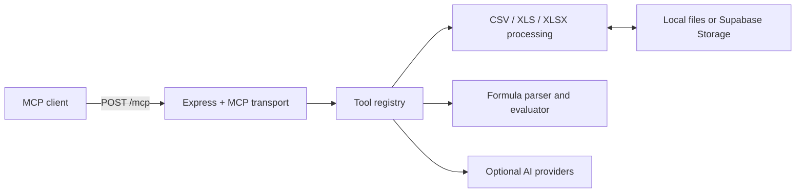

# Excel MCP Server

An MCP server for reading, analyzing, creating, and exporting CSV and Excel
files. It exposes 20 spreadsheet tools over MCP Streamable HTTP and can use
local files or shared Supabase Storage objects.

This service is the spreadsheet-processing backend for
[ExcelAI](https://github.com/Pranoschal/ExcelAI), but any MCP client that
supports Streamable HTTP can connect to it.

## Capabilities

- Read `.csv`, `.xlsx`, and `.xls` files.
- Address cells and ranges with A1 notation.
- Search, filter, aggregate, profile, and correlate spreadsheet data.
- Create CSV files and single-sheet or multi-sheet workbooks.
- Preserve formulas in generated workbooks.
- Evaluate and explain supported Excel formulas.
- Convert natural-language requests to formulas with local logic or an optional
  AI provider.
- Exchange files with ExcelAI through Supabase Storage.
- Publish generated files with one-hour signed download URLs.

## Architecture



The server listens on HTTP rather than stdio. It creates stateful MCP sessions
and returns the session ID in the `mcp-session-id` header.

## Available tools

### File access

- `read_file` — read an entire CSV or workbook sheet.
- `get_cell` — get one cell using A1 notation.
- `get_range` — get a rectangular A1 range.
- `get_headers` — return the first row.
- `search` — find exact or partial cell values.
- `filter_rows` — filter by equality, containment, or numeric comparison.
- `aggregate` — calculate sum, average, count, minimum, or maximum.

### Analytics

- `statistical_analysis` — calculate descriptive statistics for a column.
- `correlation_analysis` — calculate correlation between two numeric columns.
- `data_profile` — profile all columns in a dataset.
- `pivot_table` — group rows and aggregate a selected column.

### Creation and export

- `write_file` — create CSV, XLSX, or XLS output.
- `add_sheet` — add a sheet to an existing local workbook.
- `write_multi_sheet` — create a workbook with multiple sheets and formulas.
- `export_analysis` — export pivot, statistics, correlation, or profile output.

### Formula and optional AI operations

- `evaluate_formula` — parse and evaluate a supported formula with cell context.
- `parse_natural_language` — convert a request to a formula or command.
- `explain_formula` — explain a formula in plain language.
- `ai_provider_status` — report configured AI providers.
- `smart_data_analysis` — suggest analyses based on a dataset profile.

The formula engine implements a useful subset of Excel syntax and functions. It
is not a replacement for Excel's complete calculation engine.

## Prerequisites

- Node.js 20 or newer
- npm
- Optional: a Supabase project for remote file exchange and generated downloads
- Optional: Anthropic, OpenAI, DeepSeek, or Gemini credentials for AI-assisted
  tools

Core file and analytics tools do not require an AI API key.

## Local development

```bash
git clone https://github.com/Pranoschal/excel-mcp.git
cd excel-mcp
npm ci
```

Copy the environment template:

```bash
# macOS or Linux
cp .env.example .env

# Windows PowerShell
Copy-Item .env.example .env
```

For local-file-only use, the optional values can remain empty. To integrate with
ExcelAI, configure the shared Storage values:

```env
SUPABASE_URL=https://your-project.supabase.co
SUPABASE_SERVICE_ROLE_KEY=your-service-role-key
SUPABASE_BUCKET=excel-files
```

Start the development server:

```bash
npm run dev
```

The default endpoints are:

- Health: `http://localhost:5050/health`
- MCP: `http://localhost:5050/mcp`

Verify the process with:

```bash
curl http://localhost:5050/health
```

## Connect a client

### ExcelAI

Set the MCP base URL in ExcelAI's `.env.local`:

```env
RENDER_MCP_URL=http://localhost:5050
```

ExcelAI appends `/mcp`, discovers this server's tools, and forwards tool calls
from its Groq chat workflow.

### Other Streamable HTTP clients

Use the MCP endpoint directly. Clients that accept URL-based MCP JSON commonly
use this shape:

```json
{
  "mcpServers": {
    "excel": {
      "url": "http://localhost:5050/mcp"
    }
  }
}
```

Configuration fields differ between clients. Select **Streamable HTTP** as the
transport and use the full `/mcp` URL. A stdio configuration that launches
`dist/index.js` as a command will not work because this process serves MCP over
HTTP.

## Optional AI providers

Add one or more provider credentials to `.env`:

```env
ANTHROPIC_API_KEY=
ANTHROPIC_MODEL=claude-3-haiku-20240307

OPENAI_API_KEY=
OPENAI_MODEL=gpt-4o-mini
OPENAI_BASE_URL=

DEEPSEEK_API_KEY=
DEEPSEEK_MODEL=deepseek-v3
DEEPSEEK_BASE_URL=

GEMINI_API_KEY=
GEMINI_MODEL=gemini-2.5-pro
GEMINI_BASE_URL=
```

The local provider remains available when no remote provider is configured.
Provider credentials affect only the formula/NLP tools; the ExcelAI web app's
main chat model is configured separately in that repository.

## Production build

```bash
npm run build
npm start
```

Set `PORT` to change the listener port; it defaults to `5050`.

Other scripts:

```bash
npm run dev     # Run TypeScript directly with tsx
npm run lint    # Type-check without emitting files
npm test        # Placeholder; no automated test suite is configured
```

## Docker

Build and run the included Node 20 image:

```bash
docker build -t excel-mcp .
docker run --rm -p 5050:5050 --env-file .env excel-mcp
```

For a hosted deployment, configure the same environment variables on the host,
expose the configured port, and use `/health` for health checks. ExcelAI and
this service must use the same Supabase project and bucket.

## File handling

- Existing local paths are read directly.
- Other `filePath` values are treated as Supabase object keys and downloaded to
  the host's temporary directory.
- Generated files are first written locally, then uploaded under `generated/`.
- Signed download URLs expire after 3,600 seconds.
- Source objects, generated objects, and temporary files are not automatically
  deleted.
- `add_sheet` operates on a local workbook and does not publish a signed
  download URL.

## Project structure

```text
src/index.ts              Express entry point and HTTP routes
src/server.ts             MCP sessions and request handlers
src/tools/registry.ts     Tool registration and dispatch
src/tools/basic.ts        File access, search, filtering, aggregation
src/tools/analytics.ts    Statistics, correlation, profiling, pivots
src/tools/write.ts        File creation and analysis exports
src/tools/ai.ts           Formula and AI-assisted tools
src/formula/              Formula parser, evaluator, and functions
src/ai/                   Optional provider implementations
src/supabase-files.ts     Storage downloads, uploads, and signed URLs
```

## Security notes

- Do not commit `.env` or expose service-role/API keys to clients.
- The current server enables unrestricted CORS and does not authenticate
  `/mcp`. Protect it with private networking, an authenticated proxy, or
  application-level authentication before exposing it publicly.
- MCP sessions are stored in process memory, so they do not survive restarts or
  automatically synchronize across multiple instances.
- Apply host-level request and file-size limits for untrusted workloads.

## License

MIT
